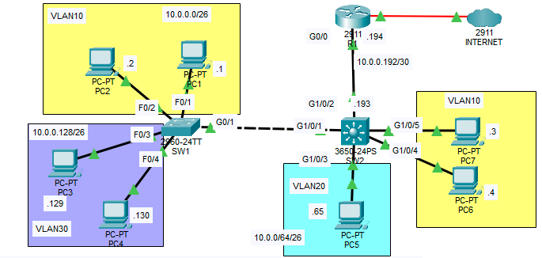

# CCNA-Network-Layer3-Multilayer-Switching-Lab

Cisco Packet Tracer lab replacing a Router-on-a-Stick (ROAS) configuration with a Layer 3 point-to-point link and multilayer switch inter-VLAN routing.

## 📋 Overview

Starting from a working ROAS setup (SW1–SW2 connected via trunk, SW2–R1 connected via ROAS with router subinterfaces), this lab converts SW2 into a Layer 3 multilayer switch. SW2 now routes between VLANs itself using Switch Virtual Interfaces (SVIs), and connects to R1 over a dedicated point-to-point Layer 3 link instead of ROAS. R1 keeps its existing route to the Internet and gains static routes back to each VLAN.

## 🗺️ Topology



---

## 🖥️ IP Addressing

| Network | Subnet | Mask |
| --- | --- | --- |
| VLAN 10 | 10.0.0.0/26 | 255.255.255.192 |
| VLAN 20 | 10.0.0.64/26 | 255.255.255.192 |
| VLAN 30 | 10.0.0.128/26 | 255.255.255.192 |
| R1–SW2 point-to-point | 10.0.0.192/30 | 255.255.255.252 |

| Device | Interface | IP Address | Role |
| --- | --- | --- | --- |
| R1 | G0/0 | 10.0.0.194 | Point-to-point link to SW2 |
| SW2 | G1/0/1 (routed port) | 10.0.0.193 | Point-to-point link to R1 |
| SW2 | VLAN 10 (SVI) | 10.0.0.62 | Default gateway for VLAN 10 (PC1, PC2, PC6, PC7) |
| SW2 | VLAN 20 (SVI) | 10.0.0.126 | Default gateway for VLAN 20 (PC5) |
| SW2 | VLAN 30 (SVI) | 10.0.0.190 | Default gateway for VLAN 30 (PC3, PC4) |

SVIs use the **last usable address** in each VLAN's subnet, per the lab requirements.

---

## ⚙️ Configuration Changes

### Step 1 — Remove ROAS from R1
Removed the `g0/0.10`, `g0/0.20`, and `g0/0.30` subinterfaces, then re-addressed the physical `g0/0` interface as a point-to-point link:
```
interface g0/0
 ip address 10.0.0.194 255.255.255.252
 no shutdown
```

### Step 2 — Convert SW2's port to R1 into a routed port
```
interface g1/0/1
 no switchport
 ip address 10.0.0.193 255.255.255.252
 no shutdown
```

### Step 3 — Enable IP routing and configure SVIs on SW2
```
ip routing

interface vlan10
 ip address 10.0.0.62 255.255.255.192
 no shutdown

interface vlan20
 ip address 10.0.0.126 255.255.255.192
 no shutdown

interface vlan30
 ip address 10.0.0.190 255.255.255.192
 no shutdown
```

### Step 4 — Routing between R1 and SW2
- **SW2** → default route toward R1's G0/0, so any traffic without a more specific match (including Internet-bound traffic) goes to R1:
  ```
  ip route 0.0.0.0 0.0.0.0 10.0.0.194
  ```
- **R1** → static routes to each VLAN subnet behind SW2, since R1 no longer has Layer 2 visibility into those VLANs:
  ```
  ip route 10.0.0.0   255.255.255.192 10.0.0.193
  ip route 10.0.0.64  255.255.255.192 10.0.0.193
  ip route 10.0.0.128 255.255.255.192 10.0.0.193
  ```

Full configs: see [`/configs`](configs)

---

## ✅ Verification

Commands used:
```
show ip interface brief
show vlan brief
show interfaces trunk
show ip route
ping <target>
```

- `show ip interface brief` on SW2 confirms each VLAN's SVI (VLAN 10, 20, 30) is **up/up**.
- `show ip route` on SW2 shows the three connected VLAN subnets, the connected point-to-point network, and a static default route (`S*`) toward 10.0.0.194.
- `show ip route` on R1 shows static routes to all three VLAN subnets via 10.0.0.193.
- Inter-VLAN pings (e.g. PC1 in VLAN 10 to PC5 in VLAN 20) confirm SW2 is routing correctly.
- A ping to `1.1.1.1` from an internal host confirms Internet reachability through R1.

Screenshots: see [`/screenshots`](screenshots)

## 🔧 Key Takeaway

A multilayer switch with `ip routing` enabled and per-VLAN SVIs can fully replace a router's ROAS role for inter-VLAN traffic. This frees the router to handle only the point-to-point uplink and external/Internet routing, removing the ROAS trunk as a potential bottleneck between the router and access layer.
